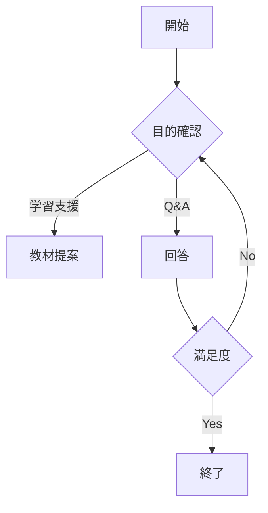

# 設計書（簡易版）

提出に必要な最小項目のみの簡易テンプレートです。

## 1. キャラクター概要（3行）
- 名前／役割：
- 性格・口調：
- 提供価値（ゴール）：

## 2. パラメータ（最大5項目）
- 例）`mood`（型／初期値／更新条件）：
- 例）`progress`（型／初期値／更新条件）：
- 例）`knowledgeLevel`（型／初期値／更新条件）：

## 3. 会話フロー（Mermaid一段）

## 4. 振る舞いルール（箇条書き3つ）
- 敬語で簡潔に回答
- NG話題は避ける（学校ルール準拠）
- 失敗時は再質問を促す

## 5. テスト観点（箇条書き3つ）
- 初回挨拶から目的確認まで遷移
- エラー時の再試行が可能
- 進捗の更新が正しく表示
