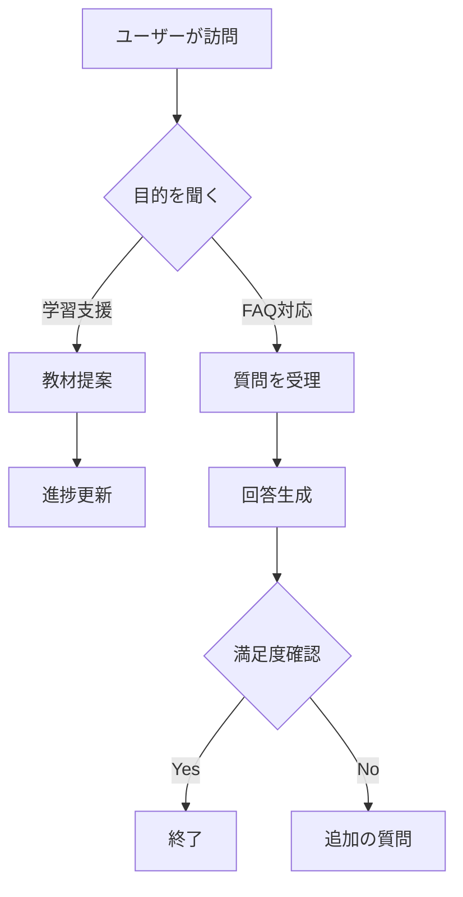

# 設計書テンプレート

以下のテンプレートに沿って記入してください。PDF提出が必要な場合は、このMarkdownをPDFに変換してください。

## 1. キャラクター設定
- 名前：
- 年齢（任意）：
- 性格・口調：
- 役割（例：案内役、アシスタントなど）：
- ゴール（ユーザーにどんな価値を提供するか）：

## 2. 保持パラメータ定義
- 状態管理の概要：
- パラメータ一覧：
  - `mood`：説明／型／初期値／更新条件
  - `knowledgeLevel`：説明／型／初期値／更新条件
  - `progress`：説明／型／初期値／更新条件
  - その他：
- データ構造（JSON例）：
```json
{
  "mood": "neutral",
  "knowledgeLevel": 1,
  "progress": 0,
  "notes": []
}
```

## 3. 会話シナリオ
- 概要：どのような対話フローを想定しているか。
- ユースケース（3〜5件）：
  1. 初回挨拶→目的確認→メニュー提示
  2. 質問受付→回答→フォローアップ提案
  3. エラー発生→リカバリ案内→再試行

### 3.1 簡易フローチャート（Mermaid）
以下にMermaidで簡易フローを記述してください。



## 4. 振る舞い・ルール
- ガイドライン（敬語／ため口など）：
- 禁則事項（NGワード、避ける話題）：
- 失敗時のリカバリ戦略：

## 5. 非機能要件
- パフォーマンス／レスポンス目標：
- ログ・監視：
- アクセシビリティ：

## 6. テスト観点
- 単体テストケース（箇条書き）：
- シナリオテスト（箇条書き）：

## 7. 今後の拡張
- 改善アイデア：
- リスクと対策：
