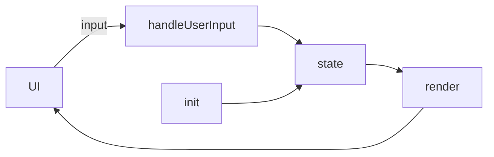

# 開発レポート（簡易版）

最小限の提出に必要な要素をまとめるテンプレートです。

## 1. Copilotログ（3件）
- 日時／プロンプト／要約結果／採否理由（1行×3件）

## 2. 成功／失敗（各1件）
- 成功：背景／提案／結果／理由（1〜2行）
- 失敗：背景／提案／結果／理由（1〜2行）

## 3. 実装理解（重要関数3つ）
- `init()`：役割／入出力／要点
- `handleUserInput(input)`：役割／入出力／状態更新
- `render()`：役割／依存／DOM更新

## 4. データフロー（任意）

## 5. 学び（箇条書き3つ）
- 例：プロンプトは具体化する
- 例：最小実装から検証する
- 例：ログ出力で原因追跡
