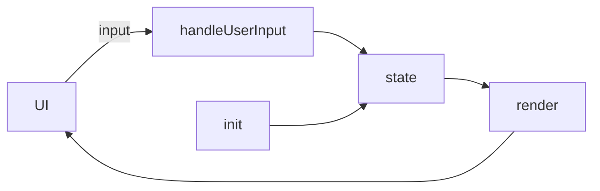

# 開発レポートテンプレート

提出形式：MarkdownまたはPDF

## 1. Copilotとの対話ログ（抜粋）
- 目的のプロンプト（原文）：
- 生成結果（要約／引用）：
- 採用した／しなかった理由：
- 重要なやり取り（3〜5件）を時系列で記載：

### ログ記録フォーマット例
```
日時: 2025-12-04 10:23
プロンプト: index.htmlのバグ修正方法を提案
生成結果: 修正案A/B/C
判断: Aを採用。理由: 既存構造と整合、影響範囲が小さい
``` 

## 2. 成功例と失敗例
- 成功例1：
  - 背景：
  - Copilot提案：
  - 結果：
  - 成功要因：
- 失敗例1：
  - 背景：
  - Copilot提案：
  - 結果：
  - 失敗要因（プロンプトの曖昧さ／仕様理解不足など）：
- 学び／改善（箇条書き）：

## 3. 実装の理解（重要な関数）
- 対象ファイル：`script.js`
- 関数一覧：
  - `init()`：役割、入力、出力、内部ロジックの要約
  - `handleUserInput(input)`：役割、入力、出力、状態更新
  - `render()`：役割、依存、DOM更新手順
  - その他、プロジェクトに合わせて記載
- データフロー図（任意／Mermaid推奨）：


## 4. リリースノート（任意）
- バージョン：
- 変更点：
- 既知の問題：
- 次の予定：
